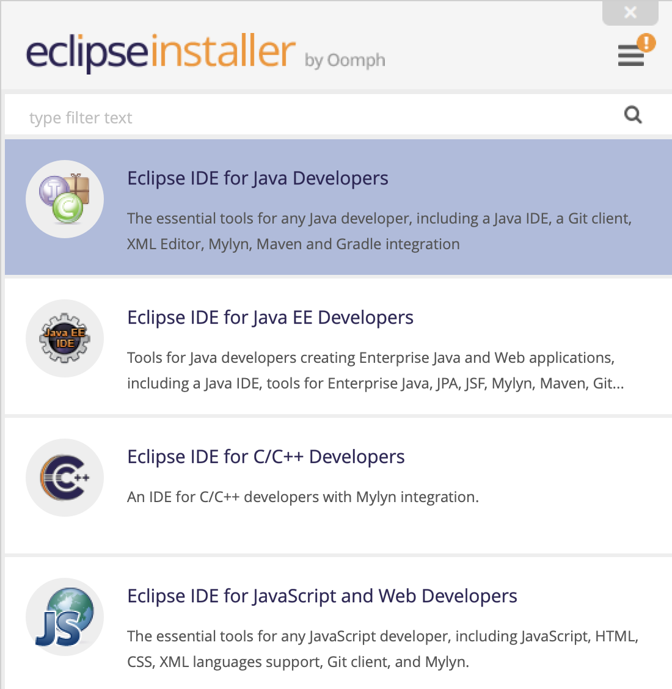

# 6.178 Tools Setup

Welcome to 6.178!

Please go through the steps below ASAP. It is __OKAY__ if you cannot complete some of them because the staff will help you trouble-shoot both on Piazza and during the first day of class. But please try to complete as much as you can before the first day, and ask for help when you need it!

If you are a cross-registrant and do not have an MIT email address, complete as many steps as you can and leave the `Kerberos` section of the student information form blank.

1. join our [course piazza page](https://piazza.com/mit/spring2019/6178)
    - unless it is a personal concern, please ask questions on Piazza rather than emailing us!
1. create an MIT GitHub Enterprise account at [MIT GitHub](https://github.mit.edu)
    - use your kerberos as your username, if you have one
1. download [Eclipse installer](https://www.eclipse.org/downloads/)
    - after launching the installer, select `Eclipse IDE for Java Developers`, as shown in the below image, then simply follow the instructions 
1. complete the following sections of [6.031 tools](http://web.mit.edu/6.031/www/fa18/getting-started/)
    - `1`, `2`, `4.1`, `5`, `6.2`
    - `1. Who are you?` of section `6.1`
1. __IMPORTANT__: [fill out the student information form](https://goo.gl/forms/2k7TOeZ3Xfglt6vo2)